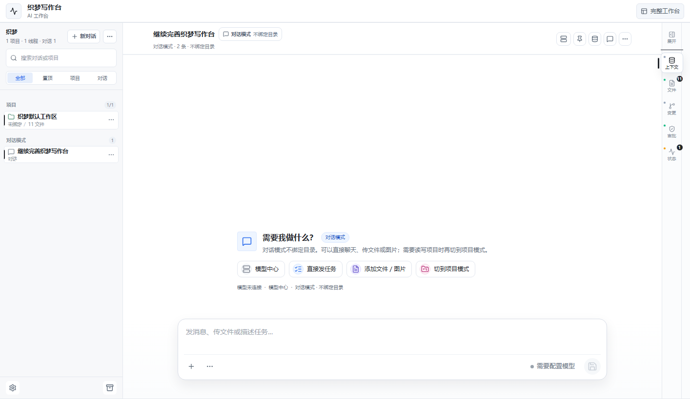

# 织梦写作台 / Zhimeng Writing Agent

> 面向中文写作与个人任务的开源 AI Agent 工作台。这里是 GitHub Pages 的 `main` 部署分支；完整源码、文档、Bridge、桌面启动器和验证脚本在 `source` 分支。

[在线体验](https://le5444.github.io/) · [完整源码](https://github.com/le5444/le5444.github.io/tree/source) · [源码 README](https://github.com/le5444/le5444.github.io/blob/source/README.md)

## 当前项目是什么

织梦写作台不是单纯的提示词网页，也不只是小说编辑器。它以中文写作和个人任务为入口，把 AI 对话、项目文件、上下文、记忆、Skills、模型配置、工具执行和审批流程组织成一个可长期陪跑的个人 AI Agent 工作台。

小说创作是重要能力，但不是整个产品边界。当前主线是继续收敛成类似 Codex / Claude Code / VS Code 的本地 Agent 工作台。

## 这次线上更新

- 首页继续保持 **Chat-first Agent Home**：左侧线程 / 项目，中间 AI 对话，右侧上下文 / 文件 / 变更 / 审批 / 状态窄栏。
- 右侧辅助栏增加更清楚的“当前下一步”主动作，不再只靠图标或日志面板猜操作。
- 状态页主动作可以直接运行或续跑 Agent Loop。
- Agent Loop 可以从当前线程最近用户消息、附件兜底、摘要或标题里提取任务，普通对话线程也能进入执行流。
- 模型 Provider 配置支持 cc switch / JSON / 半截配置粘贴解析。
- Phase 3 浏览器链路覆盖读文件、挂上下文、生成 Diff、提交审批、执行审批和写后 `read_file` 复核。

## 分支说明

- `main`：当前分支，只放 GitHub Pages 静态产物和展示 README，用来访问 [le5444.github.io](https://le5444.github.io/)。
- `source`：完整源码和开发文档。看实现、运行本地 Bridge、验证 Phase 1-5，请进 [source 分支](https://github.com/le5444/le5444.github.io/tree/source)。

## 公开边界

当前公开入口保持为 **织梦写作台 / Zhimeng Writing Agent**。底层 Agent OS / Agent IDE 架构可以继续扩展，但用户打开 GitHub 或线上页面时，第一眼应该看到的是清楚的织梦写作台：AI 对话、项目线程、文件上下文、模型配置、工具执行和审批流程。
