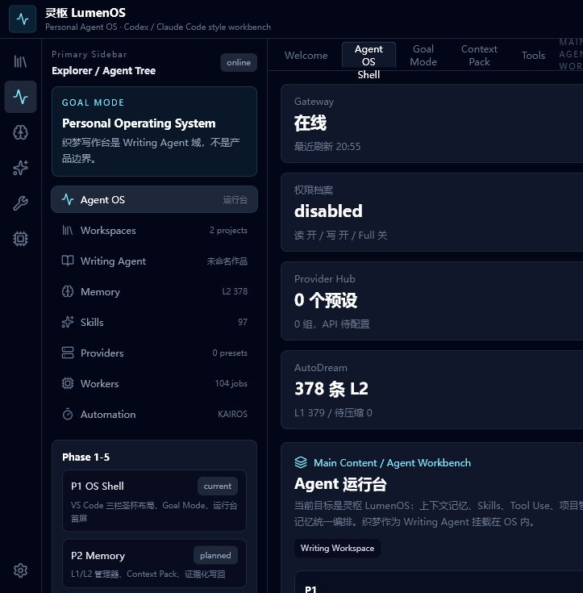

# 织梦写作台 / Zhimeng Writing Agent

> 面向中文长篇小说创作的开源 AI Agent 工作台。它从写作编辑器出发，正在升级为一个可记忆、可审查、可迭代的 Personal Agent OS。

[在线体验](https://le5444.github.io/) · [源码分支](https://github.com/le5444/le5444.github.io/tree/source) · [路线图](docs/Personal-OS-Roadmap.md)



## 一句话

织梦写作台不是单纯的提示词网页，也不只是小说编辑器。它把长篇小说创作中的灵感、设定、人物、章节、正文、伏笔、风格、记忆、Skills、工具调用和审批流程组织成一个可长期陪跑的写作 Agent 工作台。

当前产品形态分为两层：

- **织梦 Writing Agent**：服务小说创作，负责章节树、富文本写作、提示词/Skills、反崩盘检查、蒸馏、素材和项目知识库。
- **灵枢 LumenOS**：底层 Personal Agent OS，负责多工作区、线程、记忆、context_pack、Provider、Worker、Gateway、审批队列和受控工具调用。

简单说：**织梦是第一个专业 Agent 域，LumenOS 是承载它的本地 Agent 工作台。**

## 当前能力

- **小说写作工作区**：管理作品、章节、正文、设定资料、分类、版本历史和写作统计。
- **Agent 线程**：把任务、上下文附件、Worker 结果、审批 ID、Diff 和消息流沉淀到可恢复的本地线程。
- **多工作区管理器**：支持工作区搜索、领域过滤、最近打开、跨工作区定位、线程空间和工作区检查器。
- **上下文包 context_pack**：把当前任务、工作区摘要、最近文件、线程附件、记忆和 Skills 压成可审查上下文。
- **小说 Skills 库**：内置中文网文、人物、剧情、世界观、写作、修订和蒸馏相关 Skill，并支持自定义 Skill。
- **反崩盘系统**：围绕人物声音、连续性、伏笔、约束卡、成长弧线和 AI 痕迹做检查。
- **蒸馏与对标**：从参考文本中提取节奏、场景功能、叙事机制和可复用技法，避免只停留在泛泛提示词。
- **Memory Manager**：管理 L1/L2 记忆、证据、标签、冻结、软删除、备份和恢复草案。
- **Provider/API 工作台**：管理 OpenAI-compatible 等模型配置、Provider 预设、探针草案、模型列表和本地配置档案。
- **Worker / Diff / Approval**：Worker 输出默认形成草案和 Diff；写文件、记忆修改、Provider probe 等动作进入审批队列。
- **本地 Bridge / Gateway**：Python Bridge 提供健康检查、context_pack、memory、approval、provider、worker、MCP-like facade 等受控能力。
- **PWA 部署**：线上版本可作为静态 PWA 打开和安装；完整本地 Agent 能力需要启动 Bridge。

## 工作台结构

项目界面采用类似 VS Code / Codex / Claude Code 的工作台结构：

```text
Header            品牌、当前状态、刷新、源码入口、模型设置
Activity Bar      Agent OS / 工作区 / 记忆 / Skills / 工具 / Worker
Primary Sidebar   Agent 线程、工作区文件树、资源管理器
Main Workspace    Agent 运行台、命令中心、Specs、Memory、Provider、Worker
Secondary Sidebar 上下文、只读预览、Changes / Diff、运行审计
Bottom Panel      终端、输出、问题、Worker、Gateway、审批
Status Bar        当前工作区、权限、工具状态、布局状态
```

这不是为了做一个好看的 Dashboard，而是为了让写作任务、项目知识、工具执行和审批轨迹能在同一个工作流里闭环。

## 技术栈

- React 19
- TypeScript
- Vite 7
- Tailwind CSS 4
- TipTap / ProseMirror
- vite-plugin-pwa
- Python Bridge / Gateway
- Rust wrapper prototype

## 快速开始

安装依赖并启动前端：

```bash
npm install
npm run dev
```

构建普通单文件版本：

```bash
npm run build
```

构建 GitHub Pages / PWA 版本：

```bash
npm run build:pwa
```

启动本地 Bridge：

```bash
python bridge/zhimeng_bridge.py --serve
```

运行 Bridge 健康检查：

```bash
python bridge/healthcheck_bridge.py
```

也可以使用仓库里的 `.cmd` 启动脚本切换不同权限 profile，例如工作区、网络、MCP、API、完全文件权限或桌面版启动模式。

## 目录结构

```text
src/                  React 应用源码
src/anti-collapse/    小说反崩盘与连续性检查
src/components/       写作台、Agent 控制台、编辑器和管理器组件
src/store/            本地数据、设置、历史、工作区和 Provider 状态
src/utils/            Agent 计划、技能路由、Bridge 协议、上下文和工具层
skills/               小说创作 Skill 库
bridge/               本地 Agent Gateway、健康检查、MCP-like facade
desktop/              桌面版启动器和打包配置
public/               PWA 图标与兼容页面
docs/                 路线图、截图和项目说明
```

## 分支说明

这个仓库同时承担源码保存和 GitHub Pages 部署：

- `source`：完整源码、文档、Bridge、桌面启动器和 Skills。日常开发和开源阅读看这个分支。
- `main`：GitHub Pages 静态产物，来自 `dist-pwa/`，用于线上访问 [le5444.github.io](https://le5444.github.io/)。

保留 `source` 分支是为了让已有链接继续有效：

```text
https://github.com/le5444/le5444.github.io/tree/source
```

## 安全边界

项目默认采用 fail-closed 思路：模型可以生成计划、草案、上下文包和审批请求，但危险动作不会默认执行。

- 文件写入默认进入 `write_file` 审批队列。
- Memory 修改、冻结、删除、合并和恢复默认进入审批队列。
- 远程模型探针需要 Provider/Gateway/请求级授权。
- MCP、Scheduler、Skill runtime 和命令执行都有独立 gate。
- 任意 shell 不作为默认能力开放。
- API key、个人记忆、运行日志、审批状态、构建产物和本地缓存默认不进入 Git。

## 当前状态

项目仍在快速迭代中。最近一轮重点是把“小说写作工具”升级为“Agent IDE / Personal Agent OS”：

- Agent OS 首屏工作台已替代旧书架首页。
- Agent 线程、消息流、上下文附件和审批关联已落地。
- Multi Workspace Manager、工作区 context_pack、权限 profile、工作区 Skills 集已落地。
- Provider 配置草案、模型列表探针、Worker 载荷和审批执行门已落地。
- Specs / Steering / Hooks 协议管理器、Changes / Diff、底部运行面板已进入首版。

更完整的阶段规划见 [docs/Personal-OS-Roadmap.md](docs/Personal-OS-Roadmap.md)。
