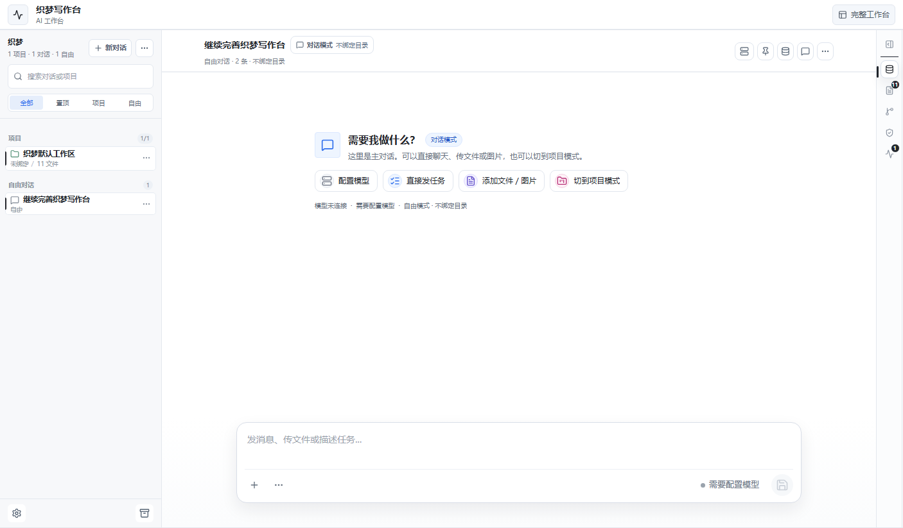

# 织梦写作台 / Zhimeng Writing Agent

> 面向中文写作与个人任务的开源 AI Agent 工作台。这里是 GitHub Pages 的静态部署分支，线上入口和项目说明都放在这里，完整源码在 `source` 分支。

[在线体验](https://le5444.github.io/) · [完整源码](https://github.com/le5444/le5444.github.io/tree/source) · [源码 README](https://github.com/le5444/le5444.github.io/blob/source/README.md)

## 项目是什么

织梦写作台不是单纯的提示词网页，也不只是小说编辑器。它以中文写作和个人任务为入口，把 AI 对话、项目文件、上下文、记忆、Skills、模型配置、工具执行和审批流程组织成一个可长期陪跑的个人 AI Agent 工作台。

小说创作是重要能力，但不是整个产品边界。当前主线是把它打磨成类似 Codex / Claude Code / VS Code 工作台体验的本地 Agent 工具。

## 当前能看到什么

- Chat-first 首页：左侧线程 / 项目列表，中间 AI 对话，右侧上下文 / 文件 / Diff / 审批 / 状态工具栏。
- 模型配置入口：支持 OpenAI-compatible baseURL、API key、模型 ID 和本地 / 远程 Provider。
- 文件上下文：支持项目目录扫描、文件预览、附件和图片进入模型请求。
- Agent Runtime：支持工具请求、只读文件工具、Diff 草案、命令审批、审批续跑和运行轨迹。
- 写作工作区：保留小说项目、章节、设定、Skills、蒸馏、反崩盘和长期写作辅助能力。

## 分支说明

- `main`：当前分支，只放 GitHub Pages 静态产物和展示 README，用来访问 [le5444.github.io](https://le5444.github.io/)。
- `source`：完整源码、文档、Bridge、桌面启动器、验证脚本和 Skills。看项目实现请进 [source 分支](https://github.com/le5444/le5444.github.io/tree/source)。

## 最新状态

当前公开入口保持为 **织梦写作台 / Zhimeng Writing Agent**。底层 Agent OS / Agent IDE 架构可以继续扩展，但用户打开 GitHub 或线上页面时，第一眼应该看到的是清楚的织梦写作台：AI 对话、项目线程、文件上下文、模型配置、工具执行和审批流程。
